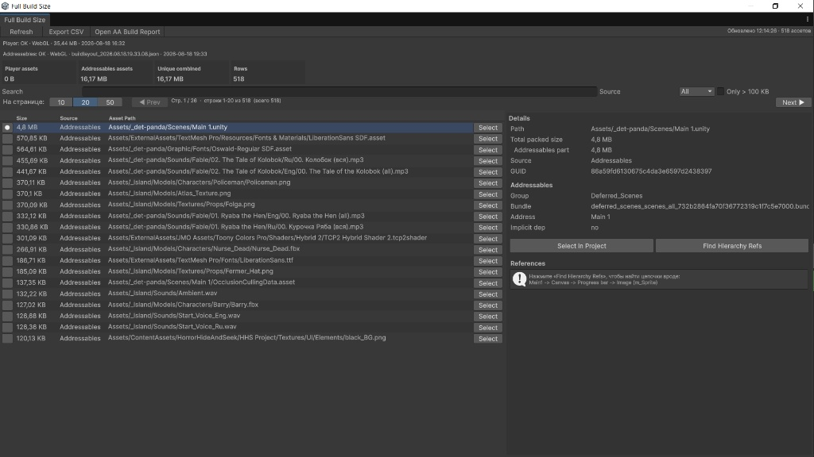

# Build Size Explorer

[](https://unity.com/)
[](LICENSE)

Advanced **Editor build size analyzer** that merges **Player BuildReport** packed assets with **Addressables Build Layout** data into one searchable window.

Find what actually landed in your last build, filter by source, export CSV, and trace references down to scene hierarchy paths.



---

## Features

- **Unified view** — Player build assets + Addressables bundle assets in one table
- **Pagination** — browse large reports (10 / 20 / 50 rows per page)
- **CSV export** — full dataset for spreadsheets or CI diffing
- **Source filters** — All, Player, Addressables, or assets in both
- **Hierarchy reference finder** — chains like `MainGame -> Canvas -> Image (m_Sprite)`
- **Asset-level references** — from Addressables Build Layout when available
- **Optional Addressables** — works without `com.unity.addressables`; AA data appears automatically when the package is installed

---

## Requirements

| Requirement | Version |
|-------------|---------|
| Unity | **2022.3** or newer |
| Addressables | **Optional** (`com.unity.addressables`) |

This package is **Editor-only** and does not affect player builds.

---

## Installation

1. Open your Unity project.
2. Go to **Window → Package Manager**.
3. Click **+ → Add package from git URL...**
4. Paste:

```
https://github.com/makarGames/Unity-Advanced-Build-Report.git
```

Git URL: [https://github.com/makarGames/Unity-Advanced-Build-Report.git](https://github.com/makarGames/Unity-Advanced-Build-Report.git)

### Optional: Addressables support

Install **Addressables** from Package Manager (`com.unity.addressables`). The explorer detects it automatically and merges Build Layout data on **Refresh**.

Without Addressables, Player BuildReport analysis still works; status shows `Addressables package not installed`.

---

## Usage

1. Open **Window → Analysis → Full Build Size Report**
2. Run a **Player Build** (Addressables layout is picked up if you use AA in your pipeline)
3. Click **Refresh**
4. Filter, paginate, inspect details, or **Export CSV**
5. Select an asset → **Find Hierarchy Refs** to locate scene/prefab usage chains

---

## Package layout

```
com.makargames.build-size-explorer/
├── package.json
├── README.md
├── CHANGELOG.md
├── LICENSE
├── Editor/
│   ├── DetPanda.BuildSizeExplorer.Editor.asmdef
│   ├── FullBuildSizeReportWindow.cs
│   ├── FullBuildSizeReportCollector.cs
│   ├── FullBuildSizeReportEntry.cs
│   ├── FullBuildSizeReportReferenceFinder.cs
│   └── Addressables/          (compiled only when Addressables is installed)
│       ├── DetPanda.BuildSizeExplorer.Editor.Addressables.asmdef
│       └── FullBuildSizeReportAddressablesCollector.cs
└── documentation/
```

---

## License

[MIT License](LICENSE)
